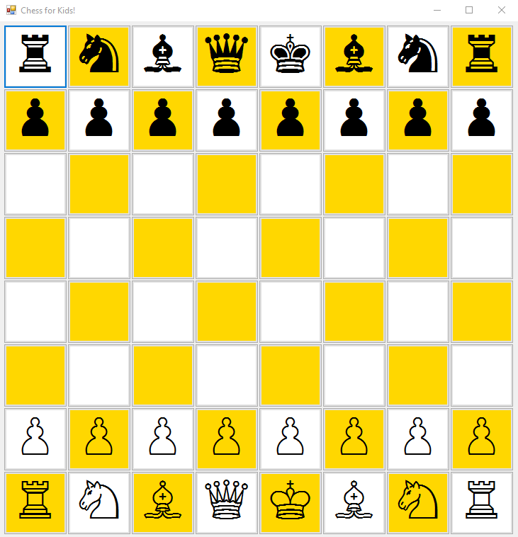

# Chess For Kids
Helps beginner chess players to know a piece's allowed moves, and threats.

# How to run
Clone this project using Visual Studio and build it, then run ChessForKids.exe from output directory.
